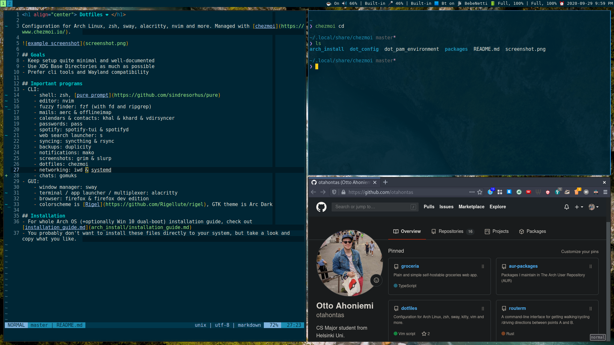

# Dotfiles ❤

This repo includes my configurations for Arch Linux and macOS.

**Arch linux**:

**macOS***

## Stuff included in this repo

- Common color schemes:
  - [Rigel](https://github.com/Rigellute/rigel) is the main theme used in sway, neovim,
    alacritty, slack etc.
  - [Arc Dark](https://github.com/horst3180/Arc-theme) is used for all GTK based
    programs
- Installation scripts:
  - Fully automated installation script for Arch Linux
  - Semi-automated installation script for MacOS (Setup Assistant needs to be run first)
- Templated dotfiles:
  - [Chezmoi](https://www.chezmoi.io/) for dotfiles management
  - Sensitive and platform-spesific contents are fetched from chezmoi.toml -file and
    password store
- Very fast terminal experince:
  - [Alacritty](https://github.com/alacritty/alacritty) terminal emulator
  - [Zsh shell](https://www.zsh.org/) with [antibody plugin manager](https://getantibody.github.io/)
    , [powerlevel10k theme](https://github.com/romkatv/powerlevel10k) and a bunch of
    useful plugins
  - [tmux](https://github.com/tmux/tmux) for terminal multiplexing
  - [fzf](https://github.com/junegunn/fzf) (with fd and ripgrep) command-line fuzzy
    finder for searching and opening files by name/content, folders, apps etc.
- Configs for text-based user interfaces (TUIs):
  - [Neovim](https://neovim.io/) with IDE-style editing experience
  - [Aerc](https://aerc-mail.org/) email client with [offlineimap](https://www.offlineimap.org/)
    for syncing
  - [Khal](https://github.com/pimutils/khal) and [Khard](https://github.com/scheibler/khard)
    for handling calendars and contacts, synced to server with [vdirsyncer](https://github.com/pimutils/vdirsyncer)
  - [pass](https://www.passwordstore.org/) for passwords
  - [spotify-tui](https://github.com/Rigellute/spotify-tui) and [spotifyd](https://github.com/Spotifyd/spotifyd)
    for spotify
  - [newsboat](https://newsboat.org/) for RSS

## (Fresh) Installation

**Arch Linux**:

- Download ISO and create bootable USB with `dd if=archlinux*.iso of=/dev/sdX && sync`
- Prepare UEFI:
  - Set boot mode to only UEFI, i.e. disable legacy mode
  - Disable secure boot
  - Add strong UEFI admin password
  - Delete preloaded OEM keys for Secure Boot, allow custom ones
- Run installation:
  - Boot to Arch live usb
  - Connect to wifi with `iwctl`
  - Run installation script with `bash <(curl -sL https://git.io/Jq9ld)`
  - Reboot and enable secure boot
  - Profit

**macOS**:

- Prepare:
  - Cleanup any previous install
  - Set up firware password
- Run graphical setup:
  - Clear NVRAM
  - Make your way through Setup Assistant
- Open terminal and run installation script with `bash <(curl -sL https://git.io/Jq9ln)`

**just dotfiles**:

- Install chezmoi
- Run `chezmoi init https://github.com/otahontas/dotfiles.git`
- See what would be changed with `chezmoi diff`
- If everything is ok, apply with `chezmoi apply`

## TODO / Known issues

- TMUX reports exit code 1 when starting on mac. This happens only on start and doesn't
  really affect anything else. Probably something happening with the wrapper script /
  zsh settings
- change to Noir theme for unified experience?
- change to Kitty? Supports tabs, true color and images
- Add setting system preferences via commands to macos script
- Add restore app settings from backups to macos script
