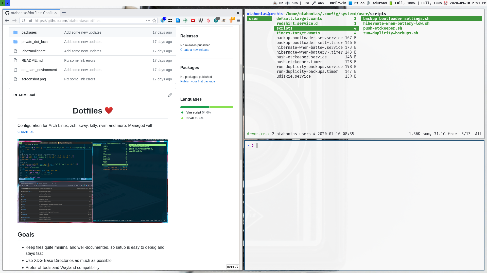

<h1 align="center"> Dotfiles ❤ </h1>

Configuration for Arch Linux, zsh, sway, alacritty, nvim and more. Managed with [chezmoi](https://www.chezmoi.io/).

## Goals
- Keep setup quite minimal and well-documented
- Use XDG Base Directories as much as possible
- Prefer cli tools and Wayland compatibility

## Important programs
- CLI:
    - shell: zsh, [pure prompt](https://github.com/sindresorhus/pure)
    - editor: nvim
    - fuzzy finder: fzf (with fd and ripgrep)
    - mails: aerc & offlineimap
    - calendars & contacts: khal & khard & vdirsyncer
    - passwords: pass
    - spotify: spotify-tui & spotifyd
    - web search launcher: s
    - syncing: syncthing & rsync
    - backups: duplicity
    - notifications: mako
    - screenshots: grim & slurp
    - dotfiles: chezmoi
    - networking: iwd & systemd
    - chats: gomuks
- GUI:
    - window manager: sway
    - terminal / app launcher / multiplexer: alacritty
    - browser: firefox & firefox dev edition
    - colorscheme is [Rigel](https://github.com/Rigellute/rigel), GTK theme is Arc Dark

## Installation
- For whole Arch OS (+optionally Win 10 dual-boot) installation guide, check out [installation_guide.md](arch_install/installation_guide.md)
- You probably don't want to install these files directly to your system, but take a look and copy what you like.
